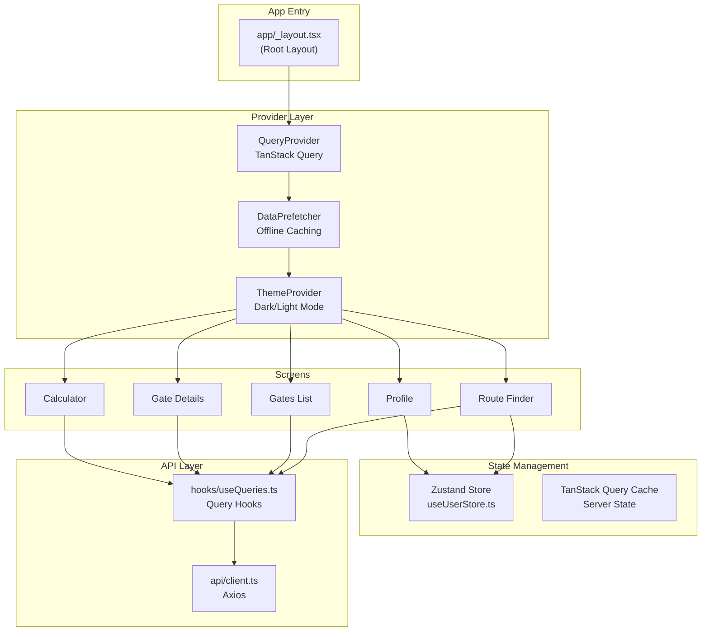

# Star Seeker Codebase Walkthrough

A comprehensive guide to the architecture, design decisions, and key components of the Star Seeker React Native app. **Version 0.4.1**

---

## 📋 Challenge Requirements Recap

The technical challenge asked you to build a **React Native mobile app** that:

1. Browses hyperspace gates and their details
2. Calculates journey costs (distance, passengers, parking)
3. Finds the cheapest route between two gates
4. Handles offline gracefully (bonus)
5. Persists favorites (bonus)
6. Includes testing (bonus)

---

## 🔑 Key Design Decisions

**Architecture**: I separated server state and client state using TanStack Query and Zustand respectively. Server state has different concerns—caching, retries, offline support—while client state is simple user preferences. This keeps the codebase clean.

**Offline Support**: I implemented aggressive pre-caching: on app load, we fetch all 13 gates and all 156 route combinations in the background. The data is cached for 7 days, so users can browse offline. A smart check skips prefetching if the cache is already complete.

**Performance**: The prefetcher throttles requests with 30-50ms delays to avoid overwhelming the API. We also use TanStack Query's `enabled` option to prevent unnecessary fetches until the user has selected both gates.

**UX**: The JourneyVisualizer uses Reanimated for a cinematic rocket animation with 'heavy inertia' easing. It gives the app a premium feel beyond just displaying data.

**Trade-offs**: NativeWind v4 has quirks with CSS variables on native, so I used a 'utility composition' strategy—mapping semantic classes in global.css. It's slightly more verbose but guarantees dark mode works correctly on iOS/Android.

---

## 🏗️ Architecture Overview



---

### 1. **Two Types of State**

| State Type       | Library        | Purpose                                                | Persistence  |
| ---------------- | -------------- | ------------------------------------------------------ | ------------ |
| **Server State** | TanStack Query | API data (gates, routes, costs)                        | 7-day cache  |
| **Client State** | Zustand        | User preferences (favorites, theme, calculator inputs) | AsyncStorage |

**Why this split?**

- Server state has different concerns: caching, retries, background updates, stale-while-revalidate
- Client state is simple key-value storage that persists across sessions
- This separation keeps the codebase clean and avoids over-engineering

### 2. **File-Based Routing (Expo Router)**

```
app/
├── _layout.tsx          # Root layout (providers, theme)
├── index.tsx            # Redirect to (tabs)/routes
└── (tabs)/
    ├── _layout.tsx      # Tab bar configuration
    ├── routes.tsx       # Route Finder (default landing page)
    ├── calculator.tsx   # Cost Calculator
    ├── profile.tsx      # User Profile & Settings
    └── gates/
        ├── index.tsx    # Gates list
        └── [code].tsx   # Dynamic route for gate details
```

**Why Expo Router?**

- Type-safe navigation (Typed Routes)
- Familiar Next.js-like file-based routing
- Deep linking support out of the box

### 3. **NativeWind (Tailwind CSS)**

- Utility-first styling with Tailwind classes
- Dark mode via CSS variables and `dark:` prefix
- **Trade-off**: NativeWind v4 has quirks with dynamic CSS variables on native
- **Solution**: "Utility Composition" in `global.css` maps semantic classes like `.bg-background` to `dark:bg-slate-950`

---

## 📁 File-by-File Breakdown

### Provider Layer

#### [app/\_layout.tsx](file:///Users/bc/Github/star_seeker/app/_layout.tsx)

**Purpose**: Root layout that wraps the entire app with providers.

**Key responsibilities**:

1. **Font loading**: Loads SpaceMono custom font
2. **Hydration check**: Waits for Zustand to hydrate from AsyncStorage before showing UI
3. **Splash screen**: Hides splash only after fonts + hydration complete
4. **Provider nesting**: `QueryProvider` → `DataPrefetcher` → `ThemeProvider`
5. **Network listener**: Connects TanStack Query's `onlineManager` to NetInfo

```typescript
// Lines 25-29: Network state sync with TanStack Query
onlineManager.setEventListener((setOnline) => {
	return NetInfo.addEventListener((state) => {
		setOnline(!!state.isConnected)
	})
})
```

This tells TanStack Query when the device is offline, so it can pause retries and show cached data.

---

### State Management

#### [store/useUserStore.ts](file:///Users/bc/Github/star_seeker/store/useUserStore.ts)

**Purpose**: Global client state persisted to AsyncStorage.

**State shape**:

```typescript
{
  favorites: string[],           // Gate codes the user starred
  colorMode: 'light' | 'dark',   // Theme preference
  calculatorSettings: {          // Last-used calculator inputs
    distance: '150',             // Default distance for immediate results
    passengers: '2',
    parking: '3'
  },
  _hasHydrated: boolean          // True once AsyncStorage loads
}
```

**Key functions**:

- `toggleFavorite(code)`: Add/remove gate from favorites
- `setColorMode(mode)`: Switch theme
- `setCalculatorSettings(settings)`: Persist calculator inputs

**Why `_hasHydrated`?**
Zustand's `persist` middleware loads data asynchronously. We need to wait before hiding the splash screen, otherwise the UI would flash with default values before syncing.

---

### API & Data Fetching

#### [api/client.ts](file:///Users/bc/Github/star_seeker/api/client.ts)

**Purpose**: Axios instance with base URL and API key.

```typescript
const client = axios.create({
	baseURL: 'https://hstc-api.testing.keyholding.com/',
	headers: {
		'x-api-key': '94962B9A-966C-43FC-8E1A-145DEAA5970C',
		'Content-Type': 'application/json',
	},
})
```

---

#### [hooks/useQueries.ts](file:///Users/bc/Github/star_seeker/hooks/useQueries.ts)

**Purpose**: Custom hooks wrapping TanStack Query for each API endpoint.

| Hook                                 | Endpoint                                             | Query Key                         |
| ------------------------------------ | ---------------------------------------------------- | --------------------------------- |
| `useGates()`                         | `/gates`                                             | `['gates']`                       |
| `useGateDetails(code)`               | `/gates/{code}`                                      | `['gate', code]`                  |
| `useCheapestRoute(from, to)`         | `/gates/{from}/to/{to}`                              | `['route', from, to]`             |
| `useTransportCost(dist, pass, park)` | `/transport/{dist}?passengers={pass}&parking={park}` | `['transport', dist, pass, park]` |

**Key pattern: `enabled` option**

```typescript
// Only fetch when we have both gates selected
enabled: !!from && !!to && from !== to
```

This prevents unnecessary API calls when the user hasn't selected both gates yet.

---

#### [components/QueryProvider.tsx](file:///Users/bc/Github/star_seeker/components/QueryProvider.tsx)

**Purpose**: Configures TanStack Query's global settings.

```typescript
const queryClient = new QueryClient({
	defaultOptions: {
		queries: {
			staleTime: 1000 * 60 * 60 * 24 * 7, // 7 days
			gcTime: 1000 * 60 * 60 * 24 * 7, // 7 days
			retry: 2,
		},
	},
})
```

**Why 7 days?**

- Gate data rarely changes in this technical challenge
- Maximizes offline capability
- User can manually refresh via Profile → "Force Data Refresh"

---

### Offline Pre-Caching System

#### [hooks/usePrefetchData.ts](file:///Users/bc/Github/star_seeker/hooks/usePrefetchData.ts)

**Purpose**: Background pre-fetches all API data for offline use.

**What it caches**:

- 13 gates (the `/gates` list)
- 13 gate details (individual gate info)
- 156 route combinations (13 × 12 A→B routes)

**Key functions**:

1. **`isCacheComplete(queryClient)`**: Checks if cache already has all expected data
2. **`prefetchAllData(queryClient, options)`**: Core prefetch logic
3. **`forceRefresh()`**: Clears cache and re-prefetches (used by Profile button)

**Optimization**: Skips prefetching if cache is already complete (within 7-day staleTime).

```typescript
// Lines 66-70: Smart skip
if (!options.skipCacheCheck && isCacheComplete(queryClient)) {
	console.log('[Prefetch] Cache already complete, skipping prefetch')
	return
}
```

---

#### [hooks/useCacheStats.ts](file:///Users/bc/Github/star_seeker/hooks/useCacheStats.ts)

**Purpose**: Returns live counts of cached data for the Profile screen.

Uses `useSyncExternalStore` to subscribe to TanStack Query's cache and reactively update the UI as data is prefetched.

---

### Screens

#### [app/(tabs)/routes.tsx](<file:///Users/bc/Github/star_seeker/app/(tabs)/routes.tsx>) — Route Finder

**Purpose**: Find the cheapest route between two gates.

**Key state**:

```typescript
const [sourceGate, setSourceGate] = useState<Gate | null>(null)
const [targetGate, setTargetGate] = useState<Gate | null>(null)
const [selectingMode, setSelectingMode] = useState<'source' | 'target' | null>(
	null
)
```

**Flow**:

1. User taps "Select Start" → Opens modal with gate list
2. User picks a gate → closes modal, sets `sourceGate`
3. User taps "Select End" → Opens modal again
4. User picks destination → `useCheapestRoute()` fires
5. API returns route with path and total cost
6. `JourneyVisualizer` animates the route

---

#### [app/(tabs)/calculator.tsx](<file:///Users/bc/Github/star_seeker/app/(tabs)/calculator.tsx>) — Cost Calculator

**Purpose**: Calculate transport costs for a given distance, passengers, and parking days.

**Uses**:

- `useTransportCost(distance, passengers, parking)` hook
- `useUserStore` to persist last-used inputs
- `calculateFleetSize()` and `formatCurrency()` utilities

**Key UX**: Inputs are controlled and persisted, so if user leaves and comes back, their values are preserved.

---

#### [app/(tabs)/gates/index.tsx](<file:///Users/bc/Github/star_seeker/app/(tabs)/gates/index.tsx>) — Gates Directory

**Purpose**: Display a scrollable list of all hyperspace gates.

**Each gate card links to** `/gates/[code]` for details.

---

#### [app/(tabs)/gates/[code].tsx](<file:///Users/bc/Github/star_seeker/app/(tabs)/gates/%5Bcode%5D.tsx>) — Gate Details

**Purpose**: Dynamic route showing detailed info for a specific gate.

Uses `useLocalSearchParams()` to get the gate code from the URL.

---

#### [app/(tabs)/profile.tsx](<file:///Users/bc/Github/star_seeker/app/(tabs)/profile.tsx>) — Profile & Settings

**Purpose**: User preferences and maintenance.

**Sections**:

1. **Favorites**: Lists actual favorite gates with links to gate details (uses `useGates()` to display names)
2. **Preferences**: Light/Dark mode toggle
3. **Offline Data**: Cache stats + "Force Data Refresh" button
4. **Version display**: Uses `APP_VERSION` constant for web compatibility

---

### Key Components

#### [components/JourneyVisualizer.tsx](file:///Users/bc/Github/star_seeker/components/JourneyVisualizer.tsx)

**Purpose**: Cinematic SVG map with animated rocket flight path.

**Features**:

- Static and warp starfield background
- Gate nodes positioned dynamically based on route
- Dashed line path connecting gates with distance labels
- Rocket icon that flies along the path with "heavy inertia" easing
- Loading state with cycling status messages

**Key animation**: Uses Reanimated's `withTiming` with a custom bezier easing `bezier(0.8, 0, 0.2, 1)` for a cinematic feel.

**Web compatibility**: Uses embedded SVG path for the rocket instead of `lucide-react-native` to ensure cross-platform rendering.

---

#### [components/OfflineBanner.tsx](file:///Users/bc/Github/star_seeker/components/OfflineBanner.tsx)

**Purpose**: Dismissable banner at the top of the screen when offline.

Uses `@react-native-community/netinfo` to detect connectivity. User can tap X to dismiss.

---

#### [components/DataPrefetcher.tsx](file:///Users/bc/Github/star_seeker/components/DataPrefetcher.tsx)

**Purpose**: Invisible component that triggers background prefetching and provides context for manual refresh.

Exposes `usePrefetch()` hook for child components to access `forceRefresh()`.

---

### Utilities

#### [utils/journey.ts](file:///Users/bc/Github/star_seeker/utils/journey.ts)

**Purpose**: Shared business logic for journey calculations.

```typescript
// Calculate how many vehicles needed for passengers
calculateFleetSize(passengers: number, capacity: number): number

// Format currency with £ symbol and 2 decimal places
formatCurrency(value: number): string
```

---

### Theming

#### [constants/Colors.ts](file:///Users/bc/Github/star_seeker/constants/Colors.ts)

**Purpose**: Single source of truth for all colors.

```typescript
export const Colors = {
  light: { background: '#ffffff', primary: '#0891b2', ... },
  dark: { background: '#020617', primary: '#22d3ee', ... },
}
```

This is imported by:

- `tailwind.config.ts` for Tailwind classes
- `useThemeColor.ts` for React Native inline styles

#### [constants/version.ts](file:///Users/bc/Github/star_seeker/constants/version.ts)

**Purpose**: Centralized version constant for web compatibility.

```typescript
export const APP_VERSION = '0.4.1'
```

**Why?**: `expo-constants` returns stale version on web. We use `Platform.OS === 'web'` to force this constant.

---

## 🧪 Testing Strategy

Located in `/__tests__/`:

- **Unit tests**: Zustand store, utility functions
- **Component tests**: OfflineBanner, ProfileScreen
- **Integration tests**: User flows

Run with: `pnpm test`

---

## 🌐 Web Compatibility

Key web-specific implementations:

1. **Browser tab titles**: Each screen sets `document.title` via `useEffect` when `Platform.OS === 'web'`
2. **Version display**: Uses `APP_VERSION` constant instead of `expo-constants`
3. **JourneyVisualizer**: Rocket icon uses embedded SVG path instead of `lucide-react-native`
4. **SVG viewBox**: Explicit `width`, `height`, and `viewBox` attributes for proper web rendering

---

### Links

- [README.md](README.md)
